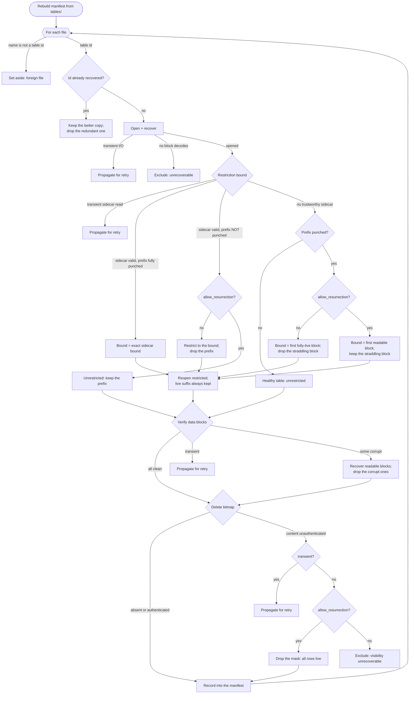

# Manifest recovery

When a database is opened without a usable manifest (it was lost, truncated, or
never committed) the engine rebuilds one by scanning the on-disk SST files under
`tables/`. Recovery is **total**: it always produces a valid, openable tree. It
never stops at a state that an operator must repair by hand, and re-running it is
deterministic, so the same bytes yield the same tree every time.

Some on-disk states are genuinely ambiguous. A tight-space-punched SST whose
restriction bound was lost can no longer prove exactly where its live data
begins; a delete bitmap whose content hash does not match could mask the wrong
rows. At every such point recovery neither guesses silently nor gives up. It
makes a deterministic choice governed by a single policy: whether to keep data
that would otherwise be **resurrected**, i.e. made visible again after the
tombstone or restriction that hid it was lost, or to drop it. That policy is the
`allow_resurrection` flag; it defaults to *drop* (never resurrect), and it is the
only knob a recovery ever exposes.

## Invariants

These hold at every branch of the algorithm below.

- **Totality.** Recovery always yields a valid, openable tree. There is no
  dead-end and no "recovered but unusable, fix it manually" outcome.
- **One policy knob.** The sole tunable is `allow_resurrection`: keep
  possibly-superseded or possibly-deleted data, or drop it. Default is drop.
- **Intact live data is never discarded to avoid ambiguous data.** A restricted
  SST is a dead prefix followed by a live suffix; the live suffix is always
  recovered, and only the ambiguous prefix is subject to the flag. The table is
  *restricted*, not set aside whole.
- **Determinism.** The same bytes and the same flag always produce the same
  result. A re-run makes no new keep-or-drop decisions.
- **Exclusion only for the genuinely unrecoverable.** A file is set aside only
  when it carries no recoverable live data whose loss the flag could have
  prevented: a name that is not a table id, a redundant duplicate of a table
  already recovered, or a file so damaged that not one block decodes. Excluding
  it still leaves a valid tree.
- **Transient versus persistent I/O.** A transient fault (`Interrupted`,
  `WouldBlock`) propagates so the caller can retry; it is never laundered into a
  keep-or-drop verdict. Persistent failures classify deterministically.

## Algorithm

## Restriction resolution

A tight-space compaction reclaims a consumed key-range prefix of an SST in place
with a hole punch, leaving the block-aligned prefix reading as zeros; the
surviving view is *restricted* to keys at or above a bound. The exact bound is a
key, recorded in a small `.restrict-bound` sidecar beside the SST. Recovery's job
is to reconstruct that restricted view even when the sidecar is not trustworthy.

The physical punch is the bound's authenticator. Three cases arise.

**The sidecar is valid and the whole prefix below its bound reads as zeros.** The
bound is proven and used exactly. This is the common, unambiguous case.

**The sidecar is valid but the prefix is not fully punched.** This is the crash
window between a compaction durably installing the restriction and the punch that
was to follow it, or a stale sidecar over a table that was never restricted. The
two are indistinguishable from disk, so the flag decides: by default honor the
bound (restrict, dropping the prefix); with resurrection enabled, keep the whole
table.

**There is no trustworthy sidecar but the SST is punched.** The bound is not
known exactly, but the punch geometry bounds it: the live data begins at the
first block that does not read as zeros. Because the bound is a key and the punch
is block-aligned, that first readable block may *straddle* the bound, holding
both superseded keys below it and live keys at or above it. With resurrection
disabled, recovery restricts to the first *fully*-live block, dropping the
straddling block: this can lose up to one block of live suffix, but it never
resurrects a superseded key, which is exactly the trade the flag governs.
Enabling resurrection keeps the straddling block (and its superseded keys) so no
live data is lost.

In every case the table is recovered restricted; its live suffix is never thrown
away to avoid the ambiguous prefix. This holds even when the live suffix is
*itself* corrupt (a rare double failure): recovery salvages the suffix's readable
blocks, drops the corrupt ones, then reopens the result restricted to the bound
and re-records its sidecar, so a later manifest-loss repair honors it. The
readable part of the suffix survives; only the corrupt blocks are lost, and
nothing below the bound is resurrected.

## Delete-mask resolution

A columnar SST records positional deletions in a delete bitmap, and the meta
block binds the bitmap's content hash. During recovery there is no whole-file
digest to cross-check, so the bitmap must authenticate against that recorded
hash before it is applied; an equal-cardinality but forged substitution would
otherwise mask the wrong rows.

An unauthenticated bitmap (forged, corrupt, or degraded) cannot be applied
faithfully: applying it masks the wrong rows, and ignoring it resurrects the
deleted ones. With resurrection disabled, the table's correct visibility is
unrecoverable, so it is excluded, and the flag recovers it by accepting
resurrection. A transient fault while checking the mask propagates for retry
rather than being read as an unauthenticated bitmap.

The same reasoning covers a corrupt catalogue that could *conceal* a deletion
section rather than corrupt a present one: its visibility is equally
unrecoverable, so by default it is excluded and the flag recovers it by accepting
resurrection. The flag governs policy, not mechanism: enabling resurrection
opens the door, but recovery can only walk through it where salvage can actually
re-emit the table. Salvage cannot re-emit a range-tombstone table, so such a
table is excluded whatever the flag; the delete-bitmap path, which salvage can
re-emit, is where the flag has observable effect. An exclusion forced by
salvage's mechanical limits is still a valid tree that opens with no manual step,
not a dead-end.

## What recovery must never do

- **Throw away a whole table to avoid an ambiguous fragment.** A restricted
  SST's live suffix is always recovered; only the ambiguous prefix is dropped.
- **End at "recovered but broken, repair by hand".** There is no manual-repair
  step; the flag is the only decision, and both of its settings yield a valid
  tree.
- **Silently resurrect.** With the flag at its default, no lost tombstone or lost
  restriction ever brings deleted or superseded data back.
- **Turn a retryable fault into a permanent verdict.** Transient I/O propagates;
  it never becomes a keep-or-drop decision.
