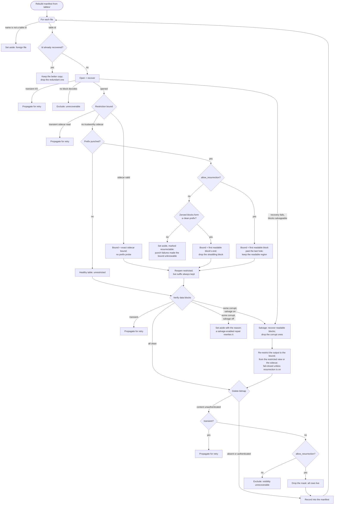

# Manifest recovery

When a database is opened without a usable manifest (it was lost, truncated, or
never committed) the engine rebuilds one by scanning the on-disk SST files under
`tables/`. Recovery is **total**: it always produces a valid, openable tree. It
never stops at a state that an operator must repair by hand, and re-running it is
deterministic, so the same bytes yield the same tree every time.

Some on-disk states are genuinely ambiguous. A tight-space-punched SST whose
restriction bound was lost can no longer prove exactly where its live data
begins; a delete bitmap whose content hash does not match could mask the wrong
rows. At every such point recovery neither guesses silently nor gives up. It
makes a deterministic choice governed by a single policy: whether to keep data
that would otherwise be **resurrected**, i.e. made visible again after the
tombstone or restriction that hid it was lost, or to drop it. That policy is the
`allow_resurrection` flag; it defaults to *drop* (never resurrect), and it is the
only knob a recovery ever exposes. It is set through
`Config::repair_with_resurrection(salvage, allow_resurrection)` (the plain
`repair` and `repair_with_salvage` entry points default it to *drop*), and it
forwards to `SalvageOptions::allow_delete_resurrection` for the delete-mask
decision, so one flag governs both the restriction prefix and the delete mask.

## Invariants

These hold at every branch of the algorithm below.

- **Totality.** Recovery always yields a valid, openable tree. There is no
  dead-end and no "recovered but unusable, fix it manually" outcome.
- **One policy knob.** The sole tunable is `allow_resurrection`: keep
  possibly-superseded or possibly-deleted data, or drop it. Default is drop.
- **Intact live data is never discarded to avoid ambiguous data.** A restricted
  SST is a dead prefix followed by a live suffix; the live suffix is always
  recovered, and only the ambiguous prefix is subject to the flag. The table is
  *restricted*, not set aside whole.
- **Determinism.** The same bytes and the same flag always produce the same
  result. A re-run makes no new keep-or-drop decisions.
- **Exclusion only for the genuinely unrecoverable.** A file is set aside only
  when it carries no recoverable live data whose loss the flag could have
  prevented: a name that is not a table id, a redundant duplicate of a table
  already recovered, or a file so damaged that not one block decodes. Excluding
  it still leaves a valid tree.
- **Transient versus persistent I/O.** A transient fault (`Interrupted`,
  `WouldBlock`) propagates so the caller can retry; it is never laundered into a
  keep-or-drop verdict. Persistent failures classify deterministically.

## Recovery model

There is no repair journal, and there is deliberately none: recovery runs
precisely when the manifest — the tree's only transaction record — is gone, so
a second log would need its own recovery. Everything recovery knows is
therefore **derived by scanning the artifacts themselves**, the way `fsck`
rebuilds a block bitmap by walking inodes instead of trusting the stored one.
Three rules follow, and every branch of the algorithm obeys them.

**The manifest commit is the only act that makes anything live.** A repair
prepares its results and then publishes them with a single atomic
`persist_version`; nothing it writes before that is reachable. Consequently a
repair never overwrites an existing table or blob-file id — a salvaged
replacement is a *new* id, and the originals stay where they were. A crash at
any earlier point therefore leaves the tree byte-for-byte as it was found,
plus unreferenced files that the next open's orphan sweep removes. This is the
copy-on-write discipline, not a journal: the old tree stays intact until the
root pointer moves.

**Durable intermediate state, if it exists at all, records absolute facts —
never deltas.** A journal replays block *contents* because only absolute
writes are idempotent under repeated replay; a recorded `old offset -> new
offset` mapping is a delta, and re-applying one to already-relocated handles
destroys live data. Recovery therefore persists no relocation records. It also
carries **nothing between runs**: a leftover from a crashed attempt cannot be
validated against a tree that may have changed underneath it, so each run
re-derives its whole picture from a fresh scan.

**In-place mutation is legal only when its result can be re-derived by
scanning.** When free space allows a copy, a damaged artifact is rebuilt into
a fresh id and published by the manifest commit (above). When space does not
allow a copy — the tight-space regime — the only permitted mutation is
*excision*: physically punching the damaged extent so that surviving data
keeps its original offsets. Excision qualifies because it is idempotent
(punching twice equals punching once) and self-describing (a zeroed,
structure-anchored run is detectable, and `derive_blob_frontier` reconstructs
the geometry from it). Relocation and compaction never qualify, because the
mapping they depend on cannot be recovered from the resulting file. This is
how filesystems treat an unreadable extent: the bad range is marked and the
rest of the file keeps reading at its original offsets, because re-laying-out
a file would invalidate every reference to it.

## Algorithm

## Restriction resolution

A tight-space compaction reclaims a consumed key-range prefix of an SST in place
with a hole punch, leaving the block-aligned prefix reading as zeros; the
surviving view is *restricted* to keys at or above a bound. The exact bound is a
key, recorded in a small `.restrict-bound` sidecar beside the SST. Recovery's job
is to reconstruct that restricted view even when the sidecar is not trustworthy.

A valid sidecar always denotes a *committed* restriction (see *A sidecar proves a
committed restriction* below). Two cases arise.

**The sidecar is valid.** Its bound is honored directly, without reading the
prefix below it. Whether the punch has run makes no difference: if the prefix is
already punched, the reopened view digests only the live suffix; if it is not
(the crash window between the durable commit and the punch, or a punch deferred
by a live reader), the installed output already covers the dropped prefix, so
honoring resurrects nothing and the punch's absence costs only unreclaimed
space, not correctness. Probing the dead prefix would add nothing, since both
probe outcomes honor the same bound; worse, a persistently unreadable sector in
an already-dead block would spuriously discard the exact bound.

**There is no trustworthy sidecar but the SST is punched.** The bound is not
known exactly; whether the punch geometry can stand in for it depends on the
punch *pattern*. When the zeroed blocks form a *clean prefix* (every zeroed
block precedes every readable one, the pattern of a fully successful reclaim),
the live data begins at the first readable block. Because the bound is a key and
the punch is block-aligned, that block may *straddle* the bound, holding both
superseded keys below it and live keys at or above it. With resurrection
disabled, recovery restricts to that block's end key, dropping the straddling
block: this can lose up to one block of live suffix, but it never resurrects a
superseded key, which is exactly the trade the flag governs.

An *irregular* pattern — a readable block below a zeroed one — is positive
evidence the reclaim did not finish: the top-down pass punched its
higher-offset blocks and then hit a failure (or a crash) before reaching the
lower ones. Any readable block may then equally be an intact-but-consumed
block the pass never reached, so no geometry bound can separate consumed data
from live: anchoring anywhere either resurrects superseded rows or discards
live ones. With resurrection disabled such a table
is *set aside* (its bound is genuinely unrecoverable); enabling resurrection
keeps the whole readable region past the last hole, accepting the re-exposure
by contract. The reclaim itself punches top-down and stops at the first
failure, so any failure (or crash mid-reclaim) leaves intact blocks strictly
below the zeroed ones — always the detectable irregular pattern, never
intact-but-consumed blocks masquerading as a live suffix above a clean prefix.
The only invisible case left is a reclaim whose very first punch failed: it
leaves no hole at all, indistinguishable from an unpunched table by
construction (no scheme can detect zero evidence), and the committed slice
output shadows that unrestricted survivor until a later compaction rewrites
it.

**Flag-dependent set-asides stay reclaimable — the knob is two-way.** Every
set-aside whose *only* cause is the disabled resurrection flag (an irregular
punch, or a punched sidecar-less source whose whole-file recovery also failed)
is written with a `.resurrectable` marker beside it in the quarantine
directory. A later repair run *with* resurrection first returns every marked
file to the tables folder and then recovers it through the normal scan, so
switching the flag never requires a manual file move in either direction.
Unmarked quarantine content — duplicates, corrupt files, bulk-ingest rejects,
salvage byproducts — is never reclaimed: those exclusions do not depend on the
flag.

Whenever a bound is known or derivable, the table is recovered restricted; its
live suffix is never thrown away to avoid the ambiguous prefix. This holds even
when the live suffix is *itself* corrupt (a rare double failure): recovery
salvages the suffix's readable blocks, drops the corrupt ones, then reopens the
result restricted to the bound and re-records its sidecar, so a later
manifest-loss repair honors it. The readable part of the suffix survives; only
the corrupt blocks are lost, and nothing below the bound is resurrected. Only
the irregular-punch state above — where no live suffix can even be delimited —
sets a table aside, and the resurrection flag still recovers its readable
region.

**Verification runs on every repair; the salvage flag only picks the remedy.**
Whole-file recovery is lazy on the data section and the manifest digest is
computed freshly from the bytes on disk, so admitting an unverified table would
*launder* any data-block corruption: the rebuilt manifest counts it recovered
and later integrity checks pass while reads of the affected block fail. Every
recovered table is therefore block-verified, with or without salvage. What
differs is the remedy for a damaged one: with salvage it is rewritten from its
readable blocks; without, it is set aside with a reason pointing at the
salvage-enabled repair. One exception is kept deliberately: a table whose
payloads all verify clean but whose ECC parity is partially rotted stays
admitted even without salvage — its digest over the rotted parity is exactly
the *attributable* state the in-place heal reconciles, so admitting it is the
entry into that repair, not a laundered digest.

**Salvage always re-restricts, on every path that reaches it.** Salvage rewrites
its source as a fresh, *unpunched* table that re-emits the straddling block's
sub-bound rows, so its output must be re-restricted to the bound or those rows
resurrect. This is a single step every salvage funnels through, whether salvage
was reached because block verification failed (the restriction is read from the
already-restricted view) or because whole-file recovery failed before producing a
table at all (the restriction is read straight from the `.restrict-bound`
sidecar). With resurrection disabled both re-impose the bound; with it enabled
both keep the whole readable region and clear the sidecar, since the unpunched
replacement would otherwise be wrongly restricted on a later repair.

**A sidecar proves a committed restriction.** Recovery honors a valid sidecar
even when the punch has not (yet) zeroed the prefix, so a sidecar that outlived an
*uncommitted* restriction would silently drop live keys. Tight-space compaction
rules that state out by ordering: the sidecar is written *strictly after* the
slice's version install commits, so its mere existence proves the restriction is
durable. An aborted slice crashes or returns before the install and so never
reaches the sidecar write — there is no uncommitted sidecar to leave behind, and
no rollback that must retract one. Only two on-disk states remain, both safe: a
sidecar present means the restriction is committed, so honoring its bound drops
only prefix the installed output already covers; and a slice that committed but
crashed before writing its sidecar leaves an unpunched input with no sidecar,
which recovers unrestricted while the committed output shadows the redundant
prefix by sequence number. That shadowing is total because a tight-space slice
output is a **superset** of its consumed inputs — the slice merge applies no
removal semantics at all: no bottommost GC (no tombstone drop, no seqno
zeroing) and no user compaction filter (its verdicts are deferred to the next
normal compaction), so the output retains every record, including a tombstone
whose deleted key also lived in this survivor's prefix but whose
tombstone-bearing sibling was fully consumed. Ordinary last-level
GC would have dropped that tombstone and re-exposed the key; retaining it keeps
the unrestricted survivor's prefix fully shadowed, so nothing resurrects. Space is
reclaimed by the hole punch, and a later normal compaction does the deferred GC.

## Blob frontier resolution

A tight-space blob defragmentation punches the consumed prefix of a stale blob
file, `[data_start, frontier)`, and records the frontier in the manifest's
blob-restrictions section — its only durable copy (blob files carry no
sidecar). When the manifest is lost, recovery re-derives the frontier from the
punch geometry itself. Unlike an SST's bound — a *key*, which the block-aligned
punch cannot reproduce, hence the sidecar — the blob frontier is a *byte
offset at a frame boundary*, so the geometry recovers it exactly: the punch
zeroes precisely `[data_start, frontier)` and the first live frame's magic
sits at the frontier.

Anchoring is structural, never length-based. A zeroed run counts only when a
valid frame decodes at its end, so a zero-filled value payload inside the live
suffix (stepped over by frame framing) can never move the frontier. A
partially completed punch — intact-but-consumed frames between holes — is
walked hole by hole, and the frontier is the end of the last anchored run.
Non-zero bytes that fail to decode end the walk at the last anchored frontier:
content corruption is not punch geometry and surfaces exactly as it would on
an unpunched file. A file whose first data byte is non-zero recovers with
frontier `0` (whole file) at zero extra read cost; this also covers the
committed-but-unpunched crash window, whose redundant prefix is superseded by
the relocated copies and reclaimed later — the same safe fallback as an SST
slice that committed without its sidecar.

The recovered file's digest covers the live region, `[frontier, end)`, and the
rebuilt snapshot re-persists the restriction from the recovered frontier, so a
later relocation resumes exactly where the punch stopped. No resurrection
question arises: blob bytes are reachable only through value handles, so a
frontier recovered too low exposes nothing. The rebuilt manifest's garbage
accounting is seeded with the punched prefix (whole-file metadata totals minus
the validation scan's live-suffix totals): no future compaction can observe
the consumed frames, so without the seed the file's stale count could never
reach its metadata totals and blob GC could never retire it.

Zeros through the *whole* data section mean the punch consumed every frame:
the relocation completed and only the file's removal lagged the crash.
Recovery completes that drop instead of publishing an empty-suffix handle —
whole-file metadata over zero live frames would leave a file blob GC's
stale-byte arithmetic can never retire. No live data is discarded: the walk
proved nothing live remains. If the removal fails, the repair fails with
that error rather than committing a manifest: left in `blobs/`, the file
would make the next open's orphan sweep hit the same removal failure, so
claiming success would describe a tree that cannot open. Quarantine is not
a fallback here — it preserves damaged *data*, and this file holds none. A
retry after the filesystem is fixed completes the drop.

## Blob frame validation and salvage

Before a blob file's digest is recorded, its live frame range is walked frame
by frame. Recording a digest over damaged content would *launder* the
corruption: every later integrity check passes (the file matches its recorded
digest) while reads of the affected values still fail. Framing checks alone
are not enough — the frame checksum is unkeyed and covers only the on-disk
bytes — so the walk verifies four independent properties: every frame decodes
and checksums cleanly with no resynchronization; every compressed payload
actually decompresses (a re-stamped checksum over an undecodable payload
frames cleanly, yet every live read fails); frame keys never regress under
the tree comparator (individually-valid frames reordered on disk break the
sorted-input contract the relocation merge scanner relies on); and, for an
unpunched file, the metadata counters — item count, uncompressed byte total,
key range — match the scanned frames (blob GC's dead-file arithmetic trusts
those counters, so an understated total could reclaim a file whose uncounted
frames are still referenced). A file that fails any of these is never blessed
as-is. It is **salvaged**: the
original moves to quarantine (preserved), every record whose checksum verifies
— decompressed and re-compressed for a compressed file, proving the content
round-trips — is re-emitted into a compacted replacement under the canonical
name, and the per-record offset relocation is retained. Records after the
first damaged frame are conservatively surrendered (their boundaries are
unprovable); a dictionary-compressed file is the one shape blob salvage cannot
re-emit, and such a file is set aside whole with its referencing tables.

A salvaged blob file is compacted, so every surviving record lands at a new
offset. The SSTs referencing it are then **rewritten** through the salvage
pipeline rather than set aside: each indirection entry is re-targeted at its
record's new offset, and only entries whose record was lost are dropped — the
lost key reads as absent afterwards, never as an error, and intact live data
is never discarded over a reshaped dependency. The same rewrite drops a stale
handle that points below a punched-but-intact blob file's frontier (a
pre-relocation SST left behind by a crash). Two shapes still set a table
aside, deterministically and with the original preserved: a table whose
reference list cannot be read, and a *restricted* survivor whose blob
dependency was reshaped (the rewrite would emit an unrestricted copy and
resurrect its punched prefix).

The blob publish and the table rewrites are separate steps, so the relocation
is made **crash-consistent** explicitly. Before the replacement takes the
canonical name, its offset remap is durably recorded in a `blobs/{id}.remap`
sidecar (checksummed, written atomically); the replacement then validates as
an ordinary intact blob on a retry, and the sidecar is what tells that retry
the referencing tables still need rewriting. Each rewritten table is stamped
per blob with a fingerprint of the remap it applied — salvage is
deterministic over an unchanged source, so a retry recomputes the same value
per blob and passes each table through only the remaps it does not carry yet
(re-applying an applied map to relocated handles would drop live entries).
The stamps are per blob rather than one whole-set value because the rewrite
set can grow between attempts — a blob newly damaged before the retry must
not un-recognize tables already rewritten for the earlier blobs. The
sidecars are removed, strictly, after the table stage and
before the manifest commit: a crash anywhere in between leaves either the
sidecar (the retry re-adopts the remap) or a fully consistent tree, while a
corrupt surviving sidecar fails the repair closed — the replacement alone
cannot say where its records used to live.

## Delete-mask resolution

A columnar SST records positional deletions in a delete bitmap, and the meta
block binds the bitmap's content hash. During recovery there is no whole-file
digest to cross-check, so the bitmap must authenticate against that recorded
hash before it is applied; an equal-cardinality but forged substitution would
otherwise mask the wrong rows.

An unauthenticated bitmap (forged, corrupt, or degraded) cannot be applied
faithfully: applying it masks the wrong rows, and ignoring it resurrects the
deleted ones. With resurrection disabled, the table's correct visibility is
unrecoverable, so it is excluded, and the flag recovers it by accepting
resurrection. A transient fault while checking the mask propagates for retry
rather than being read as an unauthenticated bitmap.

The same reasoning covers a corrupt catalogue that could *conceal* a deletion
section rather than corrupt a present one: its visibility is equally
unrecoverable, so by default it is excluded and the flag recovers it by accepting
resurrection. The flag governs policy, not mechanism: enabling resurrection
opens the door, but recovery can only walk through it where salvage can actually
re-emit the table. Salvage cannot re-emit a range-tombstone table, so such a
table is excluded whatever the flag; the delete-bitmap path, which salvage can
re-emit, is where the flag has observable effect. An exclusion forced by
salvage's mechanical limits is still a valid tree that opens with no manual step,
not a dead-end.

## What recovery must never do

- **Throw away a whole table to avoid an ambiguous fragment.** A restricted
  SST's live suffix is always recovered; only the ambiguous prefix is dropped.
- **End at "recovered but broken, repair by hand".** There is no manual-repair
  step; the flag is the only decision, and both of its settings yield a valid
  tree.
- **Silently resurrect.** With the flag at its default, no lost tombstone or lost
  restriction ever brings deleted or superseded data back.
- **Turn a retryable fault into a permanent verdict.** Transient I/O propagates;
  it never becomes a keep-or-drop decision.

## Known weak spots

Stated explicitly rather than left to be rediscovered. Each is a place where
the model above is not yet fully realised, with the consequence spelled out.

**Excision is prefix-only.** A restricted SST carries a single lower bound and
a punched blob file a single live-data frontier, so both express "everything
before this point is gone" and nothing else. A hole punched in the *middle* of
an artifact has no representation. In the tight-space regime — where a copy is
impossible and excision is the only tool — a mid-file break therefore forces a
choice between restricting past the hole (discarding intact live data below
it, against the invariant) and rewriting (needing space that is not there).
The derivation engine is not the obstacle: `dropped_data_extent_is_zeroed`
already walks a *set* of punched extents, bounds each by the next one, and
finds holes deep inside a surrendered tail — it simply reports one boolean.
The obstacle is the read model, below.

**An interior hole cannot mean "absent" — and does not.** A key range that a
table no longer covers falls through to older versions in lower levels, which
is why a lost prefix is expressed as a key-range *restriction* rather than as
missing rows. An interior hole has no such expression: the table's key range
stays contiguous around it, so treating an excised block's rows as absent
would resurrect superseded versions of exactly those keys — silently, and
regardless of `allow_resurrection`. Reads therefore take the filesystem
reading: one that resolves into an excised extent fails with
[`Error::Excised`](crate::Error::Excised), the equivalent of `EIO` on a bad
extent, so the loss is reported rather than papered over as rotted bytes
(which would invite a heal that can never succeed) or as a missing key.

That check costs nothing and stores nothing: an all-zero extent identifies
itself, so the classification happens on the failure path at read time, which
is precisely what lets an in-place excision survive a crash unrecorded. What
remains open is the *policy* half — modelling a table's coverage as a set of
key ranges, so an interior hole could be expressed as lost coverage rather
than as an erroring read. That is far more invasive: every overlap check,
seek, and compaction-input choice assumes one contiguous range per table.

**The publish phase is a sequence of renames, not one atomic act.** Publishing
under fresh ids reduces this to "write new files, then commit the manifest",
where only the commit is observable — but the file writes themselves are
several operations. They are safe because nothing references the new ids until
the commit, and unreferenced files are swept; the residual exposure is disk
space held by orphans between a crash and the next open, not correctness.

**Repair assumes an exclusive tree.** It runs single-threaded against a tree
nobody else has open, and that assumption is currently procedural rather than
enforced by a lock file. A concurrent writer during repair is undefined; the
cross-process directory lock that would enforce it is tracked separately.
Note that a lock addresses concurrency only — it is not a substitute for any
of the crash-safety properties above, which must hold even for a single
process that dies mid-repair.
